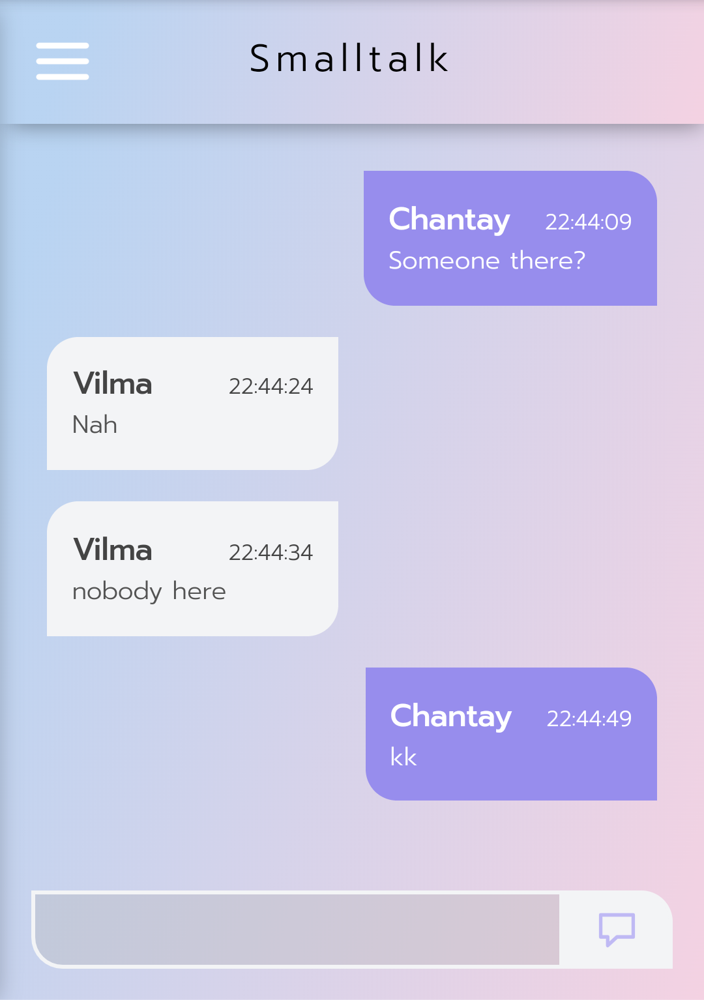
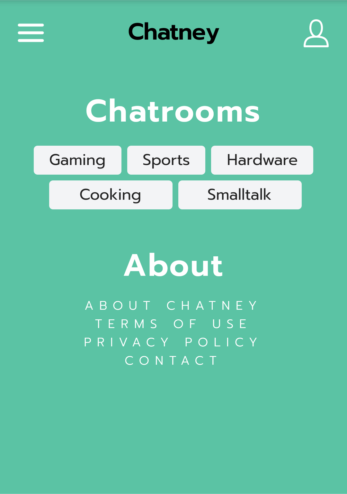

# websocket-chat
A simple chat application utilizing the websocket protocol. Powered by React + Typescript and Go.

<table>
  <tr>
    <td></td>
    <td></td>
  </tr>
</table>

# Build
Frontend:

**$ npm install**\
**$ npm run start**

Backend:

**$ go build**\
**$ ./websocket**
